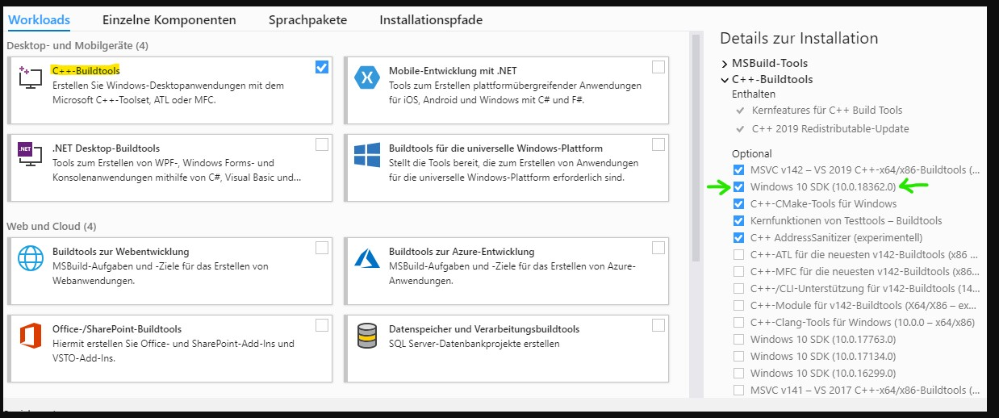

# Python Emotion Detection and Recognition System With Electron GUI

This project contains a simple electron GUI that allows the user to record .wav files. After they are recorded the emotion in them is classified. The Electron shell contains all the interface and recording features. When the Electron shell finishes recording, it immediatly calls a Python script against the .wav file. This Python scripts extracts features from the audio then classifies the emotion using an artificial nueral net.

## How does it work ( simple representation )

```text
electron
-------->|---------------|   executes 
         |   electron    |-------------> |-------------------|
         | html, css, js |               | python program    |
         |   --------    | >|.wav file|> | --------------    |
         |  > records    |               |  extracts         |
         |  > calls      |               |  features and     |
         |    python     |   emotion     |  classifies       |
         |    script     | <------------ |  emotion          |
         |---------------|               |-------------------|
```

Essentially no network is being created only one terminal is used when electron is launched and than from 
within javascript ( electron ) a python program is initiated as a subprocess.
These two programs than communicate via standart streams.

## Electron Installation Guide

1. To download and install [electron](https://electron.atom.io) ( OS X or Linux ) you have to download it from [npm-electron](https://www.npmjs.com/package/electron) using :

   ```
   npm install electron --save-dev
   ```
   ```
   npm install -g electron
   ```
   ( if you don't have npm installed use this [link](https://nodejs.org/en/download/) to download it. )

2. Clone this repository:
   ```
   git clone https://github.com/keybraker/electron-GUI-for-python.git
   ```
## Emotion Detection and Recognition System Installation Guide

1. Dowload and install [Python39](https://www.python.org/downloads/)

2. Install [Anaconda](https://www.anaconda.com/products/individual)
   
3. install build tools: https://visualstudio.microsoft.com/downloads/#build-tools-for-visual-studio-2019
   -- install the C++ Buildtools
   

4. restart your computer

6. Open administrative powershell and type `pip3 install misaka`

7. type `conda install pyaudio`

8. type `conda install numba`

9. `conda install librosa` 

10. navigate in PowerShell to the docs folder of the project

11. `conda install --file requirements.txt` if you get errors, try the next step

12. `pip install -r requirements.txt`

13. type `pip3 install misaka`

14. if you haven't gotten any install issues, naviage to the root of the project

15. `python external_programs\classify.py` the console should classify the file in emotion-detection-system\recordings\

16. You should be set to start classifying through the GUI by launching electron as outlined below


## Execution Guide

1. Open a terminal window and cd to cloned project
   ```
   cd electron-GUI-for-python
   ```

2. Initialize the elcetron aplication (first-time)
   ```
   npm i
   ```

3. Run the electron application
   ```
   npm start
   ```

4. A page should spawn looking as follows:


1. Press __LAUNCH PROGRAM___ button

   this will launch a python application with a loop inside,
   that is waiting for data to be send from js

2. Press __INTERACT WITH PROGRAM__ button

   this will send a message named "hello" from js to python
   and python will read it and print a message

3. Press __TERMINATE PROGRAM__ button

   a termination message ("terminate") is sent to the program which knows
   to stop the loop and execution

4. Press __HOW TO OPEN A FILE__ button

   from ```electron/gui_example.js``` an ipc.send message is sent to the main.js
   which will then read and output `config.json` values (fast feature to store settings).


[](https://www.python.org/downloads/)
[](https://www.python.org/download/releases/3.0/)
[](https://electron.atom.io)
[](https://www.apple.com/lae/macos/big-sur/)
[](https://ubuntu.com)


# Using the Classification Model as a Developer

It is already trained, you can use `test.py` to test your voice.

You can:
- Tweak the model parameters ( or the whole model ) in `ser.py`.
- Add more data to `data` folder in condition that the audio samples are converted to 16000Hz sample rate and mono channel, `convert_wavs.py` does that.
- Editing the emotions specified in `utils.py` in `AVAILABLE_EMOTIONS` constant.

When you modified anything, you can run `ser.py` to retrain the model.

If you want to only use this efficiently, definitely check [Emotion Recognition using Speech](https://github.com/x4nth055/emotion-recognition-using-speech) repository which ease this process a lot.