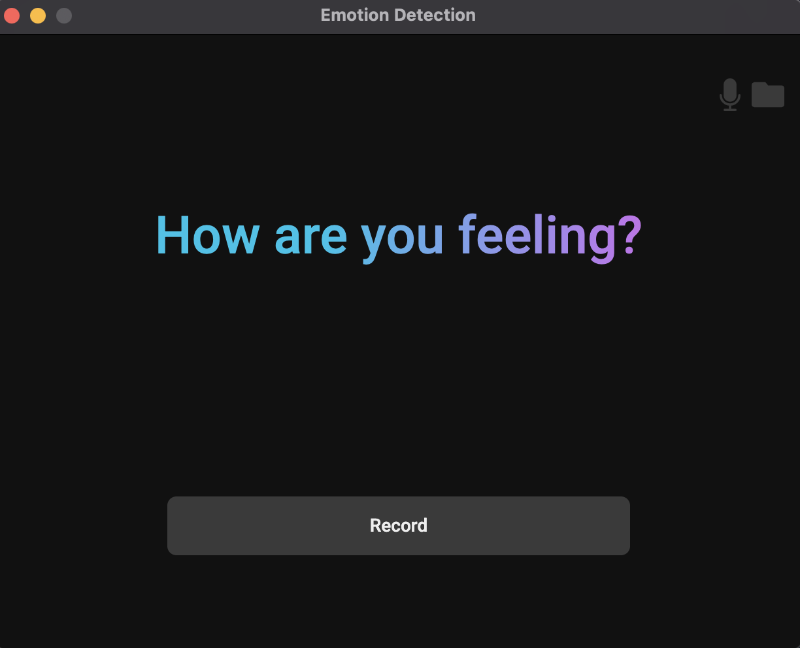

# Python Emotion Detection and Recognition System With Electron GUI

### This README is a quick guide to get the project up and running locally. For more information please visit our [Wiki](https://github.com/DaltonWemer/emotion-detection-system/wiki)

```text
electron
-------->|---------------|   executes 
         |   electron    |-------------> |-------------------|
         | html, css, js |               | python program    |
         |   --------    | >|.wav file|> | --------------    |
         |  > records    |               |  extracts         |
         |  > calls      |               |  features and     |
         |    python     |   emotion     |  classifies       |
         |    script     | <------------ |  emotion          |
         |---------------|               |-------------------|
```

This project contains a simple electron GUI that allows the user to record .wav files. After they are recorded the emotion in them is classified. The Electron shell contains all the interface and recording features. When the Electron shell finishes recording, it immediatly calls a Python script against the .wav file. This Python scripts extracts features from the audio then classifies the emotion using an artificial nueral net.


## Emotion Detection and Recognition System Installation Guide


1. To download and install [electron](https://electron.atom.io) ( OS X or Linux ) you have to download it from [npm-electron](https://www.npmjs.com/package/electron) using: 
   `npm install electron --save-dev` then `npm install -g electron`
   (if you don't have npm installed use this [link](https://nodejs.org/en/download/) to download it.)

2. If you don't have it alread, install [Python39](https://www.python.org/downloads/). Python3 is used for emotion classification.

3. Install [Anaconda](https://www.anaconda.com/products/individual). Anaconda is an excellent Python3 package manager that will ease the process of installing Python modules and dependencies.
   
4. Install [Microsoft Visual C++ Build Tools](https://visualstudio.microsoft.com/visual-cpp-build-tools/) 

5. At this stage, it is highly reccomended to restart your computer in order to refresh the enviroment.

6. Open an Anaconda Command Line session session and install our first needed Python Module: `pip3 install misaka`

7. Install the pyaudio module using Anaconda: `conda install pyaudio`

8. Install the numba module: `conda install numba`

9. Install the librosa module: `conda install librosa` 

10. If you haven't already cloned the project, go ahead and clone it to a known location. Using your elevated PowerShell session navigate to the project's 'docs' folder: `cd emotion_detection_system\docs`. 

11. Use Anaconda to install most of the remaining needed modules by calling on our requirements.txt file: `conda install --file requirements.txt`. If not all modules can be installed, try moving on to step 12.

12. Install the remaining modules using Pip: `pip install -r requirements.txt`. If not all modules install, try completing step 11 again, then returning to this step.

13. Once all modules listed in requirements.txt have been installed, then we need to install our NodeJS dependencies. From within PowerShell navigate to the root of the project: `cd ..`

14. Initialize the electron aplication and install any needed NodeJS dependencies: ```npm i```


## Execution Guide


1. Open a terminal window to the root of the cloned project: ```cd emotion_detection_system```

2. Run the electron application ```npm start```

4. A page should spawn looking as follows. Click the 'record' button to record an audio clip up to ten seconds long. The application will immediately classify the emotion in the audio then display the classification.





